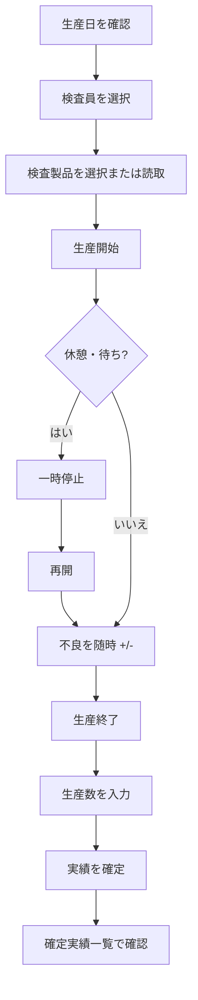

# 検査実績収集 画面 操作説明

| 項目 | 内容 |
|------|------|
| メニュー | **MES実績収集** → **検査実績収集** |
| 画面名（画面上） | **検査実績収集** |
| 保存先（サーバー） | `inspection_management` テーブル（MES 実績フィールド） |
| 不良項目マスタ | 工程別不良項目マスタ、`detection_process_cd = KT09`（検査工程） |

本書は、検査現場の担当者が **生産日・検査員・製品** を指定し、**生産開始 → 一時停止 / 再開 → 生産終了（実績確定）** までを記録する手順を、画像付きで説明します。タブレット・スマートフォンでの操作も想定しています。

---

## 目次

1. [画面の目的とできること](#1-画面の目的とできること)
2. [画面へのアクセス](#2-画面へのアクセス)
3. [推奨スクリーンショット一覧](#3-推奨スクリーンショット一覧)
4. [画面全体の構成](#4-画面全体の構成)
5. [ツールバー（上部）](#5-ツールバー上部)
6. [検査生産中ストリップ](#6-検査生産中ストリップ)
7. [オフライン・未同期の表示](#7-オフライン未同期の表示)
8. [生産カード（メイン作業エリア）](#8-生産カードメイン作業エリア)
9. [標準作業フロー](#9-標準作業フロー)
10. [不良（項目別）の入力](#10-不良項目別の入力)
11. [生産終了・実績確定ダイアログ](#11-生産終了実績確定ダイアログ)
12. [本日の確定実績](#12-本日の確定実績)
13. [確定実績の修正](#13-確定実績の修正)
14. [バーコード / QR 読取](#14-バーコード--qr-読取)
15. [複数端末・セッション復旧](#15-複数端末セッション復旧)
16. [オフライン動作と自動同期](#16-オフライン動作と自動同期)
17. [事前マスタ・権限](#17-事前マスタ権限)
18. [指標の計算方法](#18-指標の計算方法)
19. [よくあるメッセージと対処](#19-よくあるメッセージと対処)
20. [運用上の注意](#20-運用上の注意)

---

## 1. 画面の目的とできること

検査実績収集画面では、次の業務を **1 製品 × 1 検査員 × 1 生産日** 単位で記録します。

| 機能 | 説明 |
|------|------|
| 生産タイマー | 生産開始・一時停止・再開の時刻と、稼働時間・一時停止累計を記録 |
| 不良入力 | 工程マスタ（KT09）に登録された不良項目ごとに **+ / −** で数量入力 |
| 実績確定 | 生産終了時に **生産数** を入力して確定。サーバーへ保存 |
| 当日履歴 | 同一生産日で確定済みの実績を一覧表示・印刷 |
| 事後修正 | 確定後の検査員・生産数・不良・時刻の修正（オンライン時） |
| 製品読取 | 5 桁数字のバーコード / QR から検査製品を自動選択 |
| オフライン | ネット切断中も計測継続。復帰後に未送信データを自動同期 |

**対象製品の条件（システム側フィルタ）**

- 製品 CD の **末尾が `1`**（検査用製品コード）
- 製品名に **「加工」「アーチ」** を含むものは一覧から除外
- 製品名の昇順でドロップダウン表示

---

## 2. 画面へのアクセス

1. Smart-EMAPs にログインします。
2. 左サイドメニューから **MES実績収集** を展開します。
3. **検査実績収集** をクリックします。


> **権限**：メニューコード `MES_ACTUAL_INSPECTION` が付与されたロールのみ表示されます。表示されない場合はシステム管理者に権限付与を依頼してください。

---

## 3. 推奨スクリーンショット一覧

実運用マニュアル用の画像は `frontend/src/views/manual/images/InspectionActualDataCollection/` に配置します。ファイル名の詳細は [README.md](../images/InspectionActualDataCollection/README.md) を参照してください。

| 番号 | 画像パス | 用途 |
|------|----------|------|
| 全体 | [01_overview.png](./images/InspectionActualDataCollection/01_overview.png) | 画面全体像 |
| ツールバー | [03_toolbar.png](./images/InspectionActualDataCollection/03_toolbar.png) | 生産日・検査員・製品 |
| 空状態 | [05_empty_select_product.png](./images/InspectionActualDataCollection/05_empty_select_product.png) | 製品未選択 |
| 生産中 | [06_in_progress_strip.png](./images/InspectionActualDataCollection/06_in_progress_strip.png) | 当日検査生産中 |
| 計測中 | [08_production_card_running.png](./images/InspectionActualDataCollection/08_production_card_running.png) | 生産カード |
| 終了 | [11_end_dialog.png](./images/InspectionActualDataCollection/11_end_dialog.png) | 実績確定 |
| 履歴 | [12_history_table.png](./images/InspectionActualDataCollection/12_history_table.png) | 確定実績一覧 |

※ 画像ファイルは運用開始前に現場環境で撮影し、上記パスに追加してください（リポジトリ初回時はプレースホルダのみの場合があります）。

---

## 4. 画面全体の構成

画面上から下へ、次のブロックで構成されています。


```
┌─────────────────────────────────────────────────────────────┐
│ ① ページヘッダー … タイトル「検査実績収集」＋ 言語切替(JP/EN/ZH/VI) │
├─────────────────────────────────────────────────────────────┤
│ ② ツールバーカード … 生産日 / 検査員 / 検査製品 / 読取          │
├─────────────────────────────────────────────────────────────┤
│ ③ 検査生産中ストリップ … 当日・未終了の製品チップ（任意表示）     │
├─────────────────────────────────────────────────────────────┤
│ ④ オフライン・未同期バナー（任意表示）                          │
├─────────────────────────────────────────────────────────────┤
│ ⑤ 作業エリア … 空状態 または 生産カード（タイマー・操作・不良）   │
├─────────────────────────────────────────────────────────────┤
│ ⑥ 本日の確定実績 … テーブル＋印刷（確定データがある場合）        │
└─────────────────────────────────────────────────────────────┘
```

### 4.1 ページヘッダー

- **タイトル**：検査実績収集（データラインアイコン付き）
- **言語切替**（右上）：`JP` / `EN` / `ZH` / `VI` のボタンで表示言語を即時切替（画面ラベル・メッセージが変わります）


---

## 5. ツールバー（上部）

ツールバーは常に画面上部に固定表示され、**生産日**・**検査員**・**検査製品** の 3 項目を設定します。


### 5.1 生産日

| 操作 | 説明 |
|------|------|
| 日付ピッカー | 対象の生産日（`YYYY-MM-DD`、日本時間基準）を選択 |
| **◀（前日）** | 選択日を 1 日前へ |
| **今日** | 当日（JST）にジャンプ |
| **▶（翌日）** | 選択日を 1 日後へ |

**注意**

- 生産日を変更すると、その日の検査指示・確定実績・進行中セッションが再読込されます。
- 不正な日付の場合はエラーメッセージが表示されます。

### 5.2 検査員

| 項目 | 説明 |
|------|------|
| プルダウン | システムユーザー一覧から検査員を選択（氏名またはユーザー名表示） |
| クリア（×） | 検査員の選択を解除 |
| 無効な選択肢 | 他端末で検査生産中の検査員は **選択不可**（ラベル末尾に「検査生産中」） |

**タブレット向けの挙動**

- タッチ端末では、プルダウンを開いてもソフトキーボードが出ないよう **検索（filterable）がオフ** になる場合があります。一覧からタップで選択してください。

### 5.3 検査製品

| 項目 | 説明 |
|------|------|
| プルダウン | `製品CD · 製品名` 形式で選択 |
| **読取** ボタン（カメラアイコン） | バーコード / QR 読取ダイアログを開く（[§14](#14-バーコード--qr-読取)） |
| 無効化 | **生産中**（生産開始後・終了前）は製品変更不可 |

製品未選択時は、作業エリアに次のメッセージが表示されます。

> 「検査製品を選択すると作業を開始できます」


### 5.4 生産カードが表示される条件

**検査製品** と **検査員** の両方が選択されていると、中央に **生産カード** が表示されます。  
同一製品で当日すでに実績確定済みでも、再度検査員を選べば **新規の生産セッション** として記録できます（履歴は下部テーブルに残ります）。

---

## 6. 検査生産中ストリップ

当日・未終了の検査生産が 1 件以上ある場合、ツールバーの下に **「当日 検査生産中」** ストリップが表示されます。


| 表示要素 | 説明 |
|----------|------|
| 製品名チップ | 製品名（または製品 CD） |
| 検査員名 | 担当検査員。未設定時は「未選択」 |
| 他端末生産中 | 別端末がロックしている場合の短いラベル |
| **作業を再開** | 本端末で操作を引き継ぐときに押す（[§15](#15-複数端末セッション復旧)） |

**操作**

1. チップをクリック → その製品・検査生産にフォーカス（ツールバーの製品・検査員が連動）
2. 必要に応じて **作業を再開** → タイマーと操作ボタンが有効化

---

## 7. オフライン・未同期の表示

ネットワーク状態に応じて、ツールバー下にオレンジ系の **ステータスバー** が表示されます。


| 表示文言（例） | 意味 |
|----------------|------|
| オフラインです。計測は継続でき… | ブラウザがオフライン。端末に保存し、復帰後に同期 |
| 未同期 {n} 件。接続中に自動送信… | オンラインだが、サーバー未送信の PATCH がキューに残存 |

**運用**

- 一時停止・不良入力・タイマー計測はオフラインでも継続可能です。
- **生産終了の確定** と **確定実績の修正保存** は **オンライン必須** です。

---

## 8. 生産カード（メイン作業エリア）

生産カードは、選択中の製品に対する **タイマー・生産操作ボタン・不良パネル** をまとめたエリアです。

### 8.1 カード上部

| 要素 | 説明 |
|------|------|
| 製品 CD タグ | 例：`XXXXXXXX1` |
| 状態タグ | **未開始** / **計測中** / **一時停止中** / **終了済** |
| 製品名 | 読みやすい大きめの表示 |
| 不良合計 | 現在セッションの不良数量合計 |
| 検査員 | カード内でも変更可能（生産中は変更不可） |

### 8.2 タイマー表示


| 表示項目 | 説明 |
|----------|------|
| **稼働時間** | 生産開始からの経過（`HH:MM:SS`）。一時停止中も壁時計は進みます |
| フェーズ | 未開始 / 計測中 / 一時停止中 |
| **一時停止** | 一時停止の累計時間 |
| 開始 → 終了 | 生産開始・終了の日時（未設定は `—`） |

### 8.3 生産操作ボタン

| ボタン | 色・意味 | 有効条件（概要） |
|--------|----------|------------------|
| **生産開始** | 緑系 | 検査員・製品選択済み、未開始、他製品・他端末ロックなし |
| **一時停止** | 琥珀系 | 計測中かつ本端末が操作中 |
| **再開** | 緑系 | 一時停止中かつ本端末が操作中 |
| **生産終了** | 赤系 | 生産開始後（計測中または一時停止中）かつ本端末が操作中 |

ボタンが無効（グレー）のときは、§19 のメッセージ条件を確認してください。

---

## 9. 標準作業フロー

以下は、1 ロット（1 製品）の検査実績を記録する **推奨手順** です。



### ステップ 1：開始前の準備

1. **生産日** が現場の作業日と一致しているか確認（必要なら「今日」ボタン）。
2. **検査員** を選択。
3. **検査製品** をプルダウンまたは **読取** で指定。

### ステップ 2：生産開始

1. **生産開始** を押します。
2. 「生産を開始しました」と表示され、タイマーが **計測中** になります。
3. サーバーに `mes_production_started_at` 等が記録されます。

### ステップ 3：作業中

- 休憩・待機時は **一時停止** → 再開時は **再開**。
- 不良が発生したら、下部の不良パネルで **+** を押してカウント（[§10](#10-不良項目別の入力)）。
- 製品・検査員の変更は **できません**。変更する場合は先に **生産終了** してください。

### ステップ 4：生産終了・確定

1. **生産終了** を押す → 確認ダイアログが開きます（[§11](#11-生産終了実績確定ダイアログ)）。
2. 表示された開始・終了時刻・稼働時間・不良を確認。
3. **生産数** を入力。
4. **実績を確定** を押す。
5. 「実績を保存しました」と表示され、下部 **本日の確定実績** に行が追加されます。

### ステップ 5：次の製品へ

- ツールバーで別の **検査製品** を選び、同じ検査員で繰り返します。
- 別の検査員に切り替える場合は、前の検査員の生産が **すべて終了** している必要があります。

---

## 10. 不良（項目別）の入力

不良パネルは生産カード下部の **「不良（項目別）」** です。

<div class="insp-help-defect" role="img" aria-label="不良（項目別）入力例">
  <div class="insp-help-defect__panel">
    <div class="insp-help-defect__head">
      <strong>不良（項目別）</strong>
      <span>生産開始後に + / − で入力</span>
    </div>
    <section class="insp-help-defect__group">
      <header class="insp-help-defect__group-head">
        <span class="insp-help-defect__group-label">帰属工程</span>
        <span class="insp-help-defect__group-name">検査</span>
      </header>
      <div class="insp-help-defect__grid" style="--defect-cols: 8">
        <div class="insp-help-defect__cell"><span>ガリ</span><em>0</em></div>
        <div class="insp-help-defect__cell"><span>ヤケ</span><em>0</em></div>
        <div class="insp-help-defect__cell"><span>キズ</span><em>1</em></div>
        <div class="insp-help-defect__cell"><span>打痕</span><em>0</em></div>
        <div class="insp-help-defect__cell"><span>バリ</span><em>0</em></div>
        <div class="insp-help-defect__cell"><span>寸法</span><em>0</em></div>
        <div class="insp-help-defect__cell"><span>色ムラ</span><em>0</em></div>
        <div class="insp-help-defect__cell insp-help-defect__cell--on"><span>検査保留</span><em>2</em></div>
      </div>
    </section>
  </div>
</div>

> 帰属工程ごとに不良項目がグループ化されます。**検査** 工程の項目（検査保留を含む）は **1 行** で表示され、画面幅が狭い場合は横スクロールで確認できます。

| 操作 | 説明 |
|------|------|
| **−** ボタン | 該当項目の不良を 1 減らす（0 未満にはならない） |
| 中央の数字 | 現在の不良数 |
| **+** ボタン | 該当項目の不良を 1 増やす |

**ルール**

- **生産開始後** のみ入力可能（未開始・他端末ロック時は無効）。
- 項目名は **工程別不良項目マスタ**（検査工程 `KT09`）から自動取得。
- マスタ未登録時は「不良項目が未登録です（…KT09 を登録…）」と表示されます。

**不良合計**

- カード上部の **不良合計** に、全項目の合計がリアルタイム反映されます。
- 確定時、項目別の内訳は `mes_defect_by_item` として JSON 保存されます。

---

## 11. 生産終了・実績確定ダイアログ

**生産終了** 押下後に表示されるモーダルです。


### 11.1 確認内容

| 項目 | 説明 |
|------|------|
| 製品 CD・製品名 | 対象製品 |
| 検査員 | 確定時の検査員名 |
| 生産開始 / 生産終了 | 終了操作時点の時刻 |
| 稼働時間 | 開始から終了までの経過 |
| 不良合計 | 0 より大きい場合のみ表示 |
| 不良（項目別） | チップ形式で内訳表示 |

### 11.2 入力と確定

1. **生産数** 欄に、検査完了した数量（整数・0 以上）を入力。
2. **実績を確定**（プライマリボタン）をクリック。  
   - Enter キーでも確定できます。
3. **キャンセル** でダイアログを閉じ、計測を継続できます（終了時刻は確定まで確定しません）。

**制約**

- **オフライン時は確定不可**。「生産終了の確定はオンライン時のみ…」と表示されます。
- 生産数が不正（空・負数・数値以外）の場合は警告されます。

---

## 12. 本日の確定実績

生産日において **1 件以上** 実績確定があると、画面下部に **「本日の確定実績」** テーブルが表示されます。


### 12.1 列の意味

| 列名 | 内容 |
|------|------|
| 検査員 | 確定時の検査員 |
| 製品名 | 製品名称 |
| 生産数 | `actual_production_quantity` |
| 不良数 | 合計。0 超のときツールチップで項目別内訳 |
| 不良率 | 不良数 ÷ 生産数（%、小数 1 位） |
| 能率 | 生産数 ÷ 正味稼働時間（時間あたり・整数） |
| 生産開始 / 生産終了 | 日時（月日 時分） |
| 稼働時間(分) | 開始〜終了の壁時計（分・整数） |
| 一時停止(分) | 一時停止累計（分・整数） |
| 操作 | **編集** リンク |

### 12.2 印刷

1. テーブル右上の **印刷** ボタンをクリック。
2. ブラウザの印刷ダイアログが開きます（専用レイアウトの HTML を生成）。
3. 用紙に **生産日・印刷日時・件数** と表が出力されます。


**トラブル**

- ポップアップブロック時：「ポップアップがブロックされました…」→ ブラウザで当サイトのポップアップを許可。
- 印刷失敗時：再度試すか、別ブラウザで実行。

---

## 13. 確定実績の修正

確定済み行の **編集** を押すと、修正ダイアログが開きます。


### 13.1 修正できる項目

| セクション | 項目 |
|------------|------|
| 検査員 / 生産数 | 検査員プルダウン、生産数（数値スピナー） |
| 不良（項目別） | 生産中と同様の +/- ステッパー |
| 時刻 | 生産開始・生産終了（日時ピッカー） |
| 一時停止 | 累計秒数（手入力） |
| 稼働時間 | 開始・終了・一時停止から **自動計算**（表示のみ） |

下部の注意文：

> 一時停止累計は秒単位。稼働計測は開始・終了・停止から自動計算されます。

### 13.2 保存

1. 内容を修正。
2. **保存** をクリック（オンライン必須）。
3. 「確定実績を更新しました」と表示され、テーブルが更新されます。

### 13.3 MES実績クリア

ダイアログヘッダー右の **MES実績クリア** は、管理者・訂正用途です。

- MES の生産時刻・稼働・検査員・不良をクリアし、**実績確定を解除** します。
- 確認ダイアログで **よろしいですか？** と聞かれたうえで実行してください。
- 実行後、その製品は再び **生産開始** から記録できます。

---

## 14. バーコード / QR 読取

ツールバーの **読取** ボタンでカメラ読取ダイアログを開きます。


### 14.1 手順

1. **読取** をタップ（生産中は無効）。
2. ブラウザの **カメラ許可** を許可（初回のみ）。
3. 枠内にコードを合わせる。
4. 読取成功 → 検査製品が自動選択され、成功メッセージが表示されます。

### 14.2 読取ルール

| ルール | 詳細 |
|--------|------|
| 桁数 | **5 桁の数字のみ** 有効 |
| 照合 | 製品 CD の末尾が `{5桁}1` または `{5桁}` の検査製品と照合 |
| 複数一致 | 末尾 `{5桁}1` を優先。複数ある場合は CD が短い方を採用 |

**エラー例**

| メッセージ | 原因 |
|------------|------|
| 読取内容は5桁の数字である必要があります | 英字・6 桁以上など |
| 5桁（xxxxx）に一致する検査製品がありません | マスタに該当製品なし |
| 生産中は製品を変更できません | 生産開始後に読取しようとした |

### 14.3 カメラ切替

- **前面カメラ** / **背面カメラ** を切替可能（タブレット・スマホ）。
- 起動失敗時：**カメラを起動** を再試行。HTTPS とブラウザ権限を確認。

---

## 15. 複数端末・セッション復旧

検査実績は **端末 ID（mes_client_instance_id）** でロックされます。同一製品の生産を複数端末で同時操作しない仕組みです。


### 15.1 パターン一覧

| 状況 | 本端末の操作 |
|------|----------------|
| 自分が開始した生産 | 一時停止・終了・不良入力が可能 |
| 他端末が生産中 | チップに「他端末生産中」。**作業を再開** は不可。当該端末で終了を依頼 |
| ページ更新で表示が途切れた | 青い **未終了の検査生産があります** アラート → **作業を再開** |


### 15.2 作業を再開

1. ストリップまたはアラートの **作業を再開** を押す。
2. 「本端末の操作を再開しました…」と表示。
3. タイマーと **一時停止・生産終了** が再び有効になります。

### 15.3 検査員の制約

- 1 検査員が **同時に複数製品** を生産することはできません。
- 他端末で生産中の検査員は、プルダウンで選択できません。

---

## 16. オフライン動作と自動同期

| 操作 | オフライン |
|------|------------|
| 生産開始（初回 PATCH） | 可能（キューに積む） |
| 一時停止 / 再開 | 可能 |
| 不良 +/- | 可能（端末保存＋可能なら PATCH） |
| 生産終了・確定 | **不可** |
| 確定実績の編集保存 | **不可** |

**復帰時**

- オンラインになると未送信 PATCH を自動送信。
- 「{n} 件をサーバーに同期しました」等のメッセージが表示されます。
- 一部失敗時は接続を確認し、画面を再読込してください。

**ローカル永続化**

- 計測状態はブラウザのローカルストレージにも保存され、同一生産日・再訪問時に **前回の計測状態を復元** することがあります（「前回の計測状態を復元しました」）。

---

## 17. 事前マスタ・権限

運用開始前に、次を整備してください。

| 種別 | 要件 |
|------|------|
| 製品マスタ | 検査用 CD（末尾 `1`）、名称に除外語なし |
| ユーザー | 検査員として選択するアカウントが有効 |
| 工程別不良項目 | `detection_process_cd = KT09` に不良項目を登録 |
| 検査指示 | `inspection_management` に対象生産日の行が存在（なければ生産開始時に自動作成） |
| メニュー権限 | `MES_ACTUAL_INSPECTION` |
| 接続環境 | カメラ読取は **HTTPS** 推奨 |

---

## 18. 指標の計算方法

確定実績テーブルで表示される指標は、画面ロジックに基づき次のとおりです。

### 18.1 不良率

```
不良率(%) = (不良数 ÷ 生産数) × 100
```

- 生産数が 0 以下の場合は `—` 表示。
- 表示は **小数第 1 位**。

### 18.2 能率

```
能率 = 生産数 ÷ (正味稼働時間[時間])
```

- 正味稼働時間 = 壁時計の開始〜終了（秒）− 一時停止累計（秒）。
- 結果は **整数** に四捨五入。

### 18.3 稼働時間(分)・一時停止(分)

- 履歴表では **分単位の整数**（秒を 60 で割って四捨五五入）。
- 修正ダイアログ内の一時停止は **秒単位** で入力。

---

## 19. よくあるメッセージと対処

| メッセージ（要約） | 対処 |
|--------------------|------|
| 検査員を選択してください | ツールバーまたはカード内で検査員を選択 |
| 生産中は製品を変更できません | 先に生産終了してから製品変更 |
| 生産中は検査員を変更できません | 先に生産終了 |
| この検査員は別製品を生産中です | 該当製品を終了するか、別検査員を指定 |
| 製品「…」は … が検査生産中のため、開始できません | 他検査員の生産完了を待つ |
| この生産日では他の製品が検査生産中です | 進行中製品を終了してから開始 |
| 生産終了の確定はオンライン時のみ | ネット接続を復旧してから確定 |
| 確定実績の修正はオンライン時のみ | 同上 |
| 不良項目が未登録です | マスタで KT09 を登録 |
| 製品一覧の取得に失敗しました | 再読込・管理者に連絡 |
| 検査指示の取得に失敗しました | 同上 |
| この検査生産は他の端末で生産中です | ロック端末で終了、または担当者に連絡 |

---

## 20. 運用上の注意

1. **生産日の切り替え**  
   夜勤で日付をまたぐ場合は、切替タイミングを現場ルールで統一してください（「今日」ボタンで誤操作しないよう注意）。

2. **確定の忘れ**  
   生産終了ダイアログで確定しないと、サーバー上は「生産中」のまま残り、他端末・他検査員に影響します。作業終了時は必ず **実績を確定** してください。

3. **同一製品の再検査**  
   当日 2 回目以降の検査も可能です。確定実績テーブルに複数行が並びます。

4. **MES実績クリア**  
   誤確定の取り消し用です。使用履歴・権限を運用側で管理してください。

5. **ブラウザ**  
   推奨：Chrome / Edge 最新版。Safari（iOS）でも動作しますが、カメラ・印刷は事前に現場で検証してください。

6. **データの正**  
   公式な集計・報告はサーバー同期完了後の `検査実績収集データベース` を参照してください。

---

## 改訂履歴

| 日付 | 版 | 内容 |
|------|-----|------|
| 2026-05-19 | 1.0 | 初版作成（InspectionActualDataCollection.vue 準拠） |

---