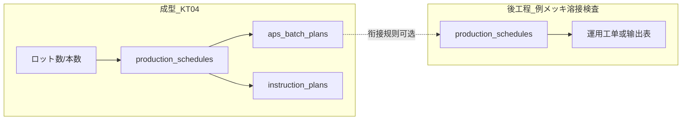
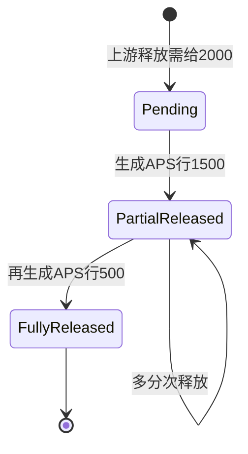

# 多工程排产方案（成型ロット vs 後工程）

## 现状摘要（代码基线）

- APS 以 `**[production_schedules](backend/app/modules/aps/models.py)**` 为核心，按 **設備（machines）** 排产；`/lines?processCd=` 用 `**machine_type` ↔ 工程名/工程CD** 过滤设备（与 `[backend/app/modules/aps/api.py](backend/app/modules/aps/api.py)` 中 `get_lines` 一致）。
- **时间粒度**：`[ScheduleSliceAllocation](backend/app/modules/aps/models.py)` 支撑日别/时间别甘特；引擎在 `replan_line_sequential` 等流程中更新。
- **成型特化**：前端 [Planning.vue](frontend/src/views/aps/Planning.vue) 默认 KT04；**ロット数 ↔ 本数**、`aps_batch_plans` 全工程写入；`**instruction_plans` 仅 KT04 设备** 同步（常量 `_APS_INSTRUCTION_PLANS_SYNC_PROCESS_CD = "KT04"`）。
- 因此：**后端已具备「按工程选线 + 同工单模型排产」**；缺口在于 **业务语义**（後工程不以ロット为计划输入单位）与 **与上游的衔接规则**。

---

## 设计原则

1. **统一排产内核**：继续使用 `production_schedules` + 现有引擎/甘特接口，避免为每个工程重写一套排程。
2. **按工程区分「计划输入形态」**：成型 = **ロット × lot_size**；後工程默认 = **本数/日**（或「槽位/炉次」等业务单位，见下）。
3. **衔接成型**：用 `**aps_batch_plans`（或 product_cd + lot_number）** 作为上游可引用实体；後工程计划字段**可选**记录「来源ロット」以便追朔与自动生成。
4. **工程别输出**：KT04 继续写 `instruction_plans`；メッキ/溶接/検査可落到 **既有 ERP 指示表** 或 **新表 `*_operation_plans`**（与 `aps_batch_plan_id` 或 `forming_lot` 外键），而不是强行塞进切断指図。

---

## 方案 A（推荐起步）：後工程独立 APS 页 + 本数计划

**适用**：メッキ・溶接・検査等以 **日产能/设备效率** 为主、计划员按品番·数量录入。

| 项目  | 做法                                                                                                                                                     |
| --- | ------------------------------------------------------------------------------------------------------------------------------------------------------ |
| UI  | 复制/抽象 [Planning.vue](frontend/src/views/aps/Planning.vue)：默认工程改为 **XX01（メッキ等）**；**隐藏或默认「本数」模式**，不强调ロット数；菜单名如「メッキ計画作成」。                                 |
| 主数据 | 各工程线在 `equipment_efficiency`（或等价主数据）维护 **能率・段取**；`machines.machine_type` 与工程マスタ一致（已有约定）。                                                               |
| 数据  | 仍写 `production_schedules` / `schedule_slice_allocations`；`aps_batch_plans` 可按工程策略：**仅成型写 lot_number 语义** 或 **後工程一行对一应出货单位**（需约定 lot_number 规则以免与成型混淆）。 |
| 与上游 | **手动**：计划员参照成型甘特/ロット一覧填品番与数量；**半自动（二期）**：从 `aps_batch_plans` 筛选「未メッキ」生成草稿行。                                                                            |

**优点**：实现快，与现网 API 兼容最大。  
**缺点**：上下游联动依赖人工或二期开发。

---

## 方案 B：上游驱动（プッシュ）— ロット完工/释放触发後工程排队

**适用**：希望 **成型每个ロット** 自动进入 **メッキ队列**（顺序或日期由规则算）。

| 项目   | 做法                                                                                          |
| ---- | ------------------------------------------------------------------------------------------- |
| 规则   | 配置 **工艺路线**（`product_cd` → 工序顺序：KT04 → メッキ → …）及 **滞后时间**（小时/天）、**并行槽位数**（メッキ槽）。            |
| 生成   | 监听或定时任务：当 `aps_batch_plans` / 成型实绩达到门槛（计划开始日或完成率），在 **メッキ线** 自动 `create_schedule` 或插入队列任务表。 |
| 计划单位 | 後工程仍为 **本数**（= 该ロット本数）；甘特显示按现有 slice 引擎。                                                    |

**优点**：链式清晰，少录入错误。  
**缺点**：需要 **路线主数据**、**释放条件** 及 possibly **新 API/批次作业**。

### 方案 B 补充：上游 2000、本工程先只做 1500、残 500 如何管理与再处理

业务上必须把 **「上游对该ロット的需处理总量」** 与 **「本工程本条 APS 行上的计划本数」** 分开；**残量** 要有唯一出处且可追溯。

#### 推荐模型：在衔接层维护「需给量 / 已释放 / 残」

增加一张 **工序间衔接队列表**（或与现有 `aps_batch_plans` 扩展列，见下），按 **上游ロット（例：`aps_batch_plans.id` 或 成型 `lot_number` + `product_cd`）× 目的工程** 一行或一行多波次：

| 概念                         | 含义                                        | 例（你的场景） |
| -------------------------- | ----------------------------------------- | ------- |
| `upstream_qty` / 需给本数      | 上游释放给本工序的待处理总量（通常=该成型ロット本数或合格出数）          | 2000    |
| `released_qty`             | 已累计下到 APS「可排产」的本数（多批次释放时累加）               | 1500    |
| `pending_qty`              | **残** = 需给 − 已释放 − （可选：已完工核销）             | 500     |
| 本工程 `production_schedules` | 每次真实排产一行：`planned_process_qty = 1500`（本波） | 1500    |

- **显示**（後工程 Planning / 衔接看板）  
  - **一行上游视角**：`ロット / 品番 | 需给 2000 | 已投入計画 1500 | **残 500** | 状態（一部投入済）`  
  - **计划一覧**：现有行仍为 1500，增加列 **来源ロット**、**本波/累计**（可选）；点击来源可展开看残 500。  
  - 甘特只反映 **已生成的 schedule（1500）**；**残 500 不占甘特条**，除非再生成第二条 schedule。
- **之后再处理（调用）的三种方式**（可并存，由参数控制）  
  1. **手动「残量投入」**：用户对残 500 点「次を計画へ」→ `released_qty += 500`（或第二波）→ `create_schedule` 500（同来源引用），`pending_qty →`。
  2. **定时/再计算自动第二波**：规则引擎在满足产能/日历/优先级时自动为 `pending_qty > 0` 的队列项生成下一条 `production_schedule`（仍建议 **每次一行**，便于实绩与 slice 对齐）。
  3. **合并到下一上游波**（一般 **不推荐** 同ロット内无业务确认就合并）：若允许，需在规则里写明；默认 **同一成型ロット的残优先单独排队**，避免混批。
- **与现有表的关系（实现取舍）**  
  - **推荐**：新建 `process_transfer_queue`（名称可改）字段含：`id`, `source_aps_batch_plan_id`, `target_process_cd`, `upstream_qty`, `released_qty`, `completed_qty`(核销实绩用), `status`, `updated_at`；`pending_qty` **计算列或 API 层计算**：`upstream_qty - released_qty - completed_qty`（若 completed 在中间表维护）。  
  - **备选**：在 `aps_batch_plans` 上按工程增加「释放累计」类字段 — **易与成型语义纠缠**，仅当坚持单表时再评估。  
  - 每条 `production_schedules` 建议 **可选外键** `transfer_queue_id` 或 `source_aps_batch_plan_id`，便于从行反查残量。

#### 要点小结

- **残 500** 必须在 **衔接队列**（或等价结构）里 **显式可见**，不能只在计划员脑子里。  
- **每次 APS 排产行** 只承载 **本波本数**（1500、后再 500），与现有引擎、甘特、slice 一致。  
- **再调用** = 对同一队列项 **第二次（第 N 次）释放** → 新建/更新 schedule + `released_qty`；实绩推进后再用 `completed_qty` 关闭队列，避免重复投入。

---

## 方案 C：後工程用「产能桶」而非ロット（メッキ槽/炉次）

若现场以 **每炉 N 本、每日 K 炉** 思考：

- 在 **不修改 DB 核心表** 的前提下：仍将 **计划数量** 记为「本」，**daily_capacity** 体现设备日折合能力；段取体现换型。
- 若必须 **炉次语义**：可扩展 `production_schedules` 附加字段（如 `batch_mode: piece | furnace`）或在 UI 层把「炉数×每炉本数」换算为 `planned_process_qty`（与成型ロット输入对称，但表意文档要写清）。

---

## 検査工程特别提示

- 多为 **抽检** 或 **与产量成比例**：计划可与 **上游完成节拍** 绑定（方案 B），或 **固定检验产能/人員カレンダー**（同一 APS 模型，资源改为「检验组」若未来扩展多资源类型）。
- 首阶段可按 **方案 A** 按本数/日录入，与生产计划对齐即可。

---

## 建议落地阶段

| 阶段  | 内容                                                                                           |
| --- | -------------------------------------------------------------------------------------------- |
| P0  | 方案 A：新菜單 + 工程別 Planning 变体（本数为主），接入现有 `POST/PUT /api/aps/schedules` 与 `replan`。              |
| P1  | 明确 **後工程是否写入** `aps_batch_plans` 的列语义；若混淆则增加 `plan_kind` 或按工程分表视图。                           |
| P2  | 方案 B：`routing` 主数据 + 从 `aps_batch_plans` 生成後工程 draft；工序间队列表（需给/已释放/残）+ UI 残量表示与再投入。          |
| P3  | メッキ/溶接 **专用指図表**（若存在）与 APS 同步，类似当前 KT04→`instruction_plans` 的 **按工程注册 sync 钩子**（代替写死仅 KT04）。 |

---

## 风险与决策点

- `**aps_batch_plans` 跨工程语义**：若多工程共用同一表，建议在文档与 UI 标注「成型ロット」vs「他工程计划行」，或 P1 增加类型字段，避免报表歧义。
- `**instruction_plans` 仅切断用途**：メッキ/溶接应 **新目标表或现有模块**，避免与切断业务耦合。
- **设备主数据**：任何工程要 APS，必须 **machines + equipment_efficiency + process** 链完整（与成型相同前提）。

---

## 总结

- **メッキ等工程计划**：技术上 **沿用同一 APS 排产内核**；产品上 **用「本数计划 + 工程別画面」** 与成型「ロット计划」区分。
- **与成型衔接**：短期 **人工 + aps_batch_plans 参照**；中期 **工艺路线 + プッシュ生成**（方案 B）。
- **代码层面后续**：将 `Planning.vue` 工程参数化、后端 `_APS_INSTRUCTION_PLANS_SYNC_PROCESS_CD` 扩展为 **可配置同步目标**（多工程多表），与业务表设计一并迭代。

